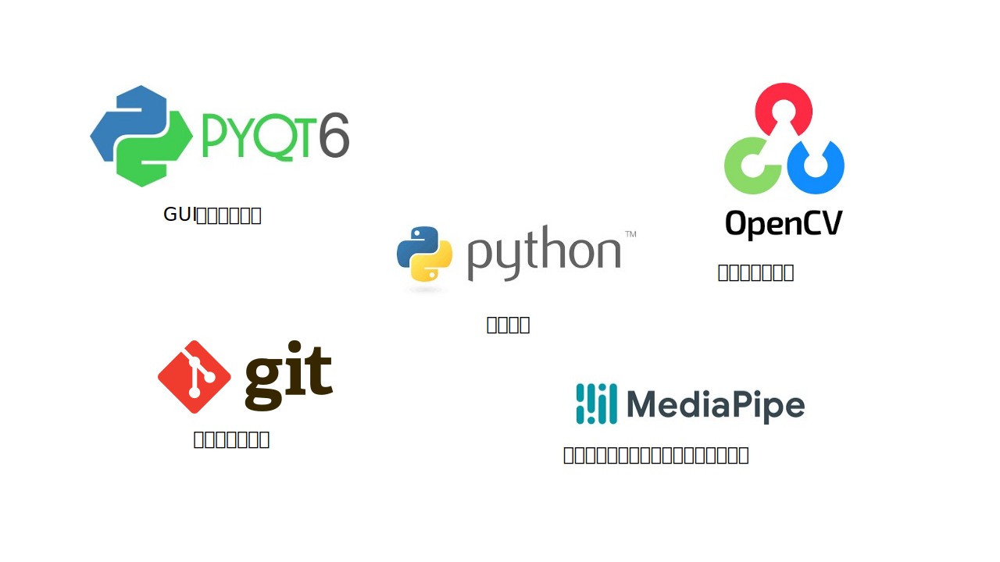

# VirtualCloth


## アプリケーションの概要
**ZOOM のために、スーツ着るのめんどくさくないですか？**

ユーザーが寝起きでパジャマでも、暑くてTシャツでも、服装をスーツやカッターシャツに加工してくれるアプリケーションです。
オンライン会議アプリに自分のカメラとして投影することができます。

### 実装機能
* 服装描画の表示/非表示機能
* 描画する服装の切り替え機能（スーツ，カッターシャツ）
* 投影カメラの切り替え機能（カメラIDの指定）

### 今後の展望
* 正確な服装の拡大・縮小
* 対応衣装の種類数の増加
* 服装データの、より自然な合成

## 実行方法
1. ライブラリのインストール

以下のコマンドにより、実行に必要なライブラリがインストールされます。
```
pip install -r ./requirements.txt
```
2. OBS、ZOOMのインストール

下記リンクから、必要なアプリケーションをダウンロードしてください。
* [OBS Studio](https://obsproject.com/ja/download)
* [Zoom](https://zoom.us/ja/download)

3. メインプログラムを実行

以下のコマンドを実行し、メインプログラムを実行します。
```
py main.py
```
4. OBSで、実行プログラムによる加工映像を仮想カメラとして認識
    1. OBSを起動する
    2. ソースタブの'+'ボタンをクリックし、"ウィンドウキャプチャ"を選択、新規作成する。(macOSの場合は、"macOS スクリーンキャプチャ)
    3. 作成したウィンドウキャプチャをダブルクリックし、ウィンドウプロパティの値を"\[python.exe\]:Virtual Try-On"に設定する
    4. コントロールタブ内の、"仮想カメラ開始"をクリック
5. ZOOMにて、仮想カメラの映像を投影
    1. ミーティングに参加する際のカメラ設定にて、"OBS Virtual Camera"を選択する
    2. カメラの撮影範囲の調整は、OBSにて行う
6. カメラ撮影の終了

"Virtual Cloth"ウィンドウの"×"ボタンを押す

## 技術スタック
開発で使用した技術スタックは以下のようになっています。
